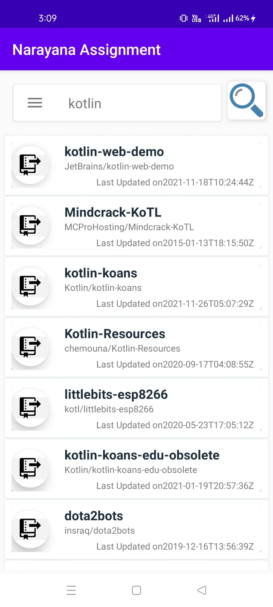
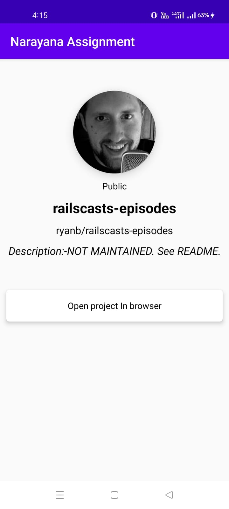

# consists of paging + room for offline retrival + reterofit 
Used MVVm archtecture...........

## Screenshot of Paging
||  
|:----:|

## Searching repos
||  

## Details of repos
||  

## Download APK from here👇

<a href="https://drive.google.com/file/d/1k4Xk1IK324xc06QpazdVxH8l8WqVn44K/view?usp=sharing">Dowload here</a>

